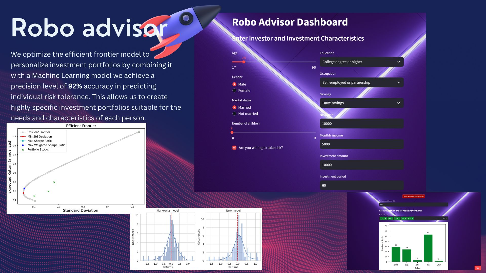

# Predictive Investment Platform

## Description

Welcome to our Predictive Investment Platform! 

Our tool allows users to input their personal data and investment preferences to receive precise recommendations. 
We utilize an advanced Machine Learning algorithm designed to predict user risk tolerance and provide personalized financial guidance.
Check out the aplication [here](https://roboadvisor.streamlit.app/)

## Data and Accuracy

Our model is based on a robust dataset collected from 28,886 surveys conducted as part of the **Survey of Consumer Finances (SCF)** in 2019. The accuracy of our algorithm stands at an impressive 92%, ensuring reliable and personalized recommendations.

## Optimal Portfolio

We employ the **Markowitz Efficient Frontier Optimization** algorithm to compute an optimal investment portfolio. This approach has been optimized and improved by an astonishing 23% compared to the original 1950 model. The resulting portfolio consists of a combination of 5 stocks listed on the **S&P 500**.

## Future

Our commitment is to continue enhancing and expanding our services. We are working on future updates that will enable the system to create combinations with stock indices from around the world and offer a broader range of investment instruments, including funds, bonds, royal state, and more.

Thank you for choosing our platform! We look forward to assisting you in making informed and successful financial decisions.

## Disclaimer

**Please note that this project is intended for academic and research purposes only.** The recommendations generated by our platform should be used for educational and informational purposes and should not be considered as professional financial advice. Investing in financial markets carries inherent risks, and the decisions made based on the recommendations are solely the responsibility of the individual users.

We strongly advise users to consult with qualified financial professionals and conduct their own research and due diligence before making any investment decisions. The creators and maintainers of this platform do not assume any liability for the financial outcomes or consequences resulting from the use of the recommendations provided by our system.

Thank you for understanding and using our platform responsibly.

